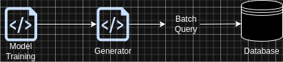

# Bilinear Model for Movie Ratings
> Andres Torres, University of Rhode Island

## Introduction

Collaborative filtering and recommender systems are a set of statistical modeling techniques that predict the rating users will give to products and are used as a tool to help users find what they like within a company's product offerings. In this project, we explore an extension to linear regression models to build a recommender system on the [Netflix Prize data set](https://www.kaggle.com/datasets/netflix-inc/netflix-prize-data). The main objective is to provide a discussion and overview of the Alternating Least Squares (ALS) model as a solution to this problem. The idea behind ALS is to leverage the collective wisdom of a group of users to make recommendations for an individual user, where a latent representation of users an movies is learned during training and is thereafter used to predict the ratings. [Code Repository](https://github.com/af-torres/recommender-system) with model implementation.

## Methodology

### Data set

The Netflix Prize data set, is a vast and influential collection released by Netflix to enhance the performance of their recommendation algorithm. This is a substantial dataset comprised of a training set and a validation (probe) set, with the training set alone encompassing over 100 million ratings from nearly 500,000 users on almost 18,000 movies. The sheer magnitude of the dataset, containing a wealth of user interactions with a diverse array of movies, provide a rich resource for developing and fine-tuning recommendation algorithms but come with significant computational and statistical challenges.

We will represent this data set as a matrix $r$ of size $480,189 × 17,770$ where each row represents a user, each column represents a movie an every element $r_{i,j}$ of the matrix is the rating given to movie $j$ by user $i$. Somethings to note 1. the matrix $r$ is that it is 99% sparse as just about 100 million of its elements have a correct value, and, 2. our objective is to create a reconstruction of the matrix, that is fill out all the missing elements in the matrix, that minimizes the RMSE of predictions with respect to the true values as evaluated by the probe data.

### Alternating Least Squares (ALS)

The Alternating Least Squares (ALS) methodology leverages the properties of Singular Value Decomposition (SVG) to create the best $k$ rank reconstruction of the objective matrix $r$, as represented by:

\begin{align*}
r = UDV^{'}
\end{align*}

Where the reconstruction provided by $UDV^{'}$ minimizes the Frobenius norm $‖r − UDV^{'}‖$, defined as the square root of the sum of the squares of its entries. This is one of the most important properties of SVG, as the reconstruction achieved from this method is a monotonically decreasing function of the RMSE for the ratings predictions, thus, by using this method we are guaranteed to be minimizing our objective function on the Netflix Prize challenge.

Additionally, the reconstruction of the rating matrix can be expressed as $U V^{′}$ where $U$ is $m × k$ and $V$ is $k × n$, and $m$ is the total number of users and $n$ the total number of movies. This reconstruction is thus formed from the inner products between the k-vectors comprising $U$ with those comprising $V$. These k-vectors may be thought of as associated, respectively, with the rows and the columns of the ratings matrix, and the components of these vectors are often referred as *latent features* discovered for the association between users and movies.

To determine the best k reconstruction of the rating matrix, we then proceed with the Alternating Least Squares (ALS) method by first expressing the summation in the objective function in two ways:

\begin{align*}
\sum \sum_{C} (r_{i,j} - \sum_{p = 1}^{k} u_{i,p} v_{j,p} )^{2} \\
= \sum_{j = 1}^{J} \sum_{i \in I(j)} (r_{i,j} - \sum_{p = 1}^{k} u_{i,p} v_{j,p} )^{2} \\
=  \sum_{i = 1}^{I} \sum_{j \in J(i)} (r_{i,j} - \sum_{p = 1}^{k} u_{i,p} v_{j,p} )^{2}
\end{align*}

Where $C$ is the set of all known ratings, $I$ is the set of all users, $J$ is the set of all movies, $J(i)$ is the set of all movies rated by user $i$, and $I(j)$ is the set of all users who have rated the movie $j$.

We can now use this form of expressing the objective function to perform a coordinate descend by alternatively updating the $U$ and $V$. The specific algorithm is:

1. Randomly initialize matrix $U \sim {\sf N}(0, 1)$.
2. Fit a set of linear models, via Least Squares, using the known ratings as the response and $U$ as the predictors. Set the values of $V$ equal to the coefficients of the linear models.
3. Fit a set of linear models, via Least Squares, using the known ratings as the response and $V$ as the predictors. Set the values of $U$ equal to the coefficients of the linear models.
4. Repeat 2 and 3 until convergence.

Keep in mind that $U$ is a latent representation of the users and $V$ is a latent representation of the movies, thus, $U_{i, 1...k}$ is a vector of the least squares coefficients found using the ratings made by user $i$ ($r_{i, J(i)}$) as a response, and the latent representation of the movies $J(i)$ in $V$ ($V_{J(i), 1...k}$) as the predictors. On the other hand, $V_{j, 1...k}$ is a vector of the least squares coefficients found using the ratings of movie $j$ ($r_{I(j), j}$) as a response, the latent representation of the users $I(j)$ in $U$ ($U_{I(j), 1...k}$) as the predictors.

## Results and discussion

In this project we implemented the previously described methodology ALS to the Netflix Prize data set. During the real data analysis process, working with the high dimensionality of the data was one of the most difficult aspects of the project, thus in this section we will focus on how we tackled this challenge, along with the results achieved from the fitted model as its evaluation over the probe data set, and some of the short comings of our specific implementation.

### Project Architecture

During the implementation of the recommender system, we quickly realized that the vast amount of data in the training set would require our program to efficiently manage computing resources for the training procedure. After some iterations, it became obvious that a namespace abstraction to batch the training data was a requirement thus we structured our module around the idea of data generators. A generator, is a module that samples ordered values from the ratings available in the training data ordered and indexed by either user id or movie id, e.g, a user generator will iteratively query a data store to retrieve batches of ratings made by a set users with id in the range (start:start + batchSize). This data will then be used to find the values of the latent representation of $V$.

The trade-off made by the use of different generators was one between memory and speed. For this project, we used a generated based on a B-tree structure that allowed us to achieve a search time complexity of $O(log(n))$ and $O(n)$ space complexity.

Even tho the final implementation used a B-tree as a data store, a more time efficient way found was one where the ordering and search of the batches was amortized by creating ordered pages for users and movies batches. In other words, this generator would order once the data and write that to storage pages. Afterwards, each batch would be generated just by sequentially reading the generated pages. This approach achieves a constant amortized search time complexity at the cost of duplicating the space complexity (still linear). The main assumption of this generator, is that the ratings are not changing and no insertion or update operations will be needed.

### Training and Validation RMSE

During the training procedure, for this project, just one ALS step was executed to completion as the total runtime of each step with the B-tree based generator was around 14.5 hours. Even tho only one complete step of ALS was executed, the results are still impressive:

>SSE: 99,047,143.807453

>size: 1,408,809

>MSE: 70.30558706499816

>RMSE: 8.384842697689573

With up to 10 iterations of ALS, one could expect to achieve an RMSE of 0.95 over the probe data. Having such a small RMSE with a model as simple as the one implemented in this project, showcases that linear models are very powerful and that not much conditioning is necessary to build very accurate recommender systems.

## References

[1] Feuerverger, A., He, Y., & Khatri, S. (2012). Statistical significance of the Netflix chal-
lenge.
